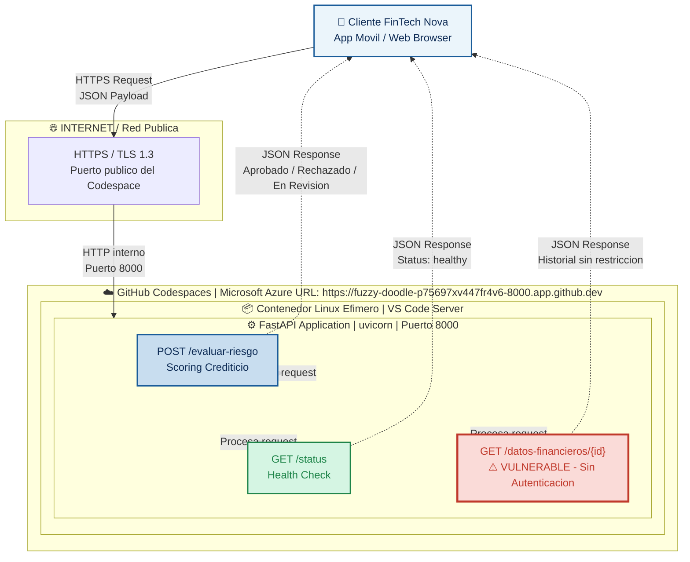

# API de Predicción de Datos

Esta es una API sencilla desarrollada con FastAPI para fines educativos y de práctica en análisis de vulnerabilidades, despliegue de aplicaciones y pruebas de servicios web.

## Descripción

La API incluye:

- Endpoint principal de bienvenida.
- Endpoint de verificación de estado (Health Check).
- Endpoint de consulta de datos de usuarios.
- Base de datos simulada en memoria.

> **Nota:** El endpoint `/datos-sensibles/{usuario}` fue diseñado con fines académicos para analizar posibles vulnerabilidades relacionadas con el control de acceso y la autenticación.

---

## Estructura del Proyecto

```text
.
├── main.py
├── requirements.txt
└── README.md
```

---

## Requisitos

- Python 3.9 o superior
- GitHub Codespaces (recomendado)
- Pip

---

## Dependencias

Archivo `requirements.txt`

```txt
fastapi
uvicorn
```

Instalar dependencias:

```bash
pip install -r requirements.txt
```

---

## Ejecución en GitHub Codespaces

### Paso 1. Abrir el proyecto

1. Ingrese al repositorio de GitHub.
2. Seleccione **Code**.
3. Haga clic en **Codespaces**.
4. Cree un nuevo Codespace.

---

### Paso 2. Instalar dependencias

En la terminal ejecute:

```bash
pip install -r requirements.txt
```

---

### Paso 3. Iniciar la API

Ejecute el siguiente comando:

```bash
uvicorn main:app --host 0.0.0.0 --port 8000
```

Si todo funciona correctamente, verá un mensaje similar a:

```text
INFO:     Uvicorn running on http://0.0.0.0:8000
```

---

## Endpoints Disponibles

### 1. Página Principal

**GET /**

Devuelve un mensaje de bienvenida.

Ejemplo:

```json
{
  "mensaje": "Bienvenido a la API de Análisis. El sistema está en línea."
}
```

---

### 2. Estado del Sistema

**GET /status**

Permite verificar que la API está funcionando correctamente.

Ejemplo:

```json
{
  "status": "ok",
  "servicios": "operativos"
}
```

---

### 3. Consulta de Datos de Usuario

**GET /datos-sensibles/{usuario}**

Obtiene información asociada a un usuario almacenado en la base de datos simulada.

Ejemplo:

```http
GET /datos-sensibles/user1
```

Respuesta:

```json
{
  "usuario": "user1",
  "estado": "Activo",
  "datos_financieros": "Confidencial"
}
```

---

## Usuarios Disponibles

La base de datos simulada contiene:

| Usuario | Estado |
|----------|----------|
| user1 | Activo |
| user2 | Inactivo |

---

## Documentación Automática

FastAPI genera documentación interactiva automáticamente.

Una vez ejecutada la aplicación, puede acceder a:

### Swagger UI

```text
http://localhost:8000/docs
```

### ReDoc

```text
http://localhost:8000/redoc
```

---

## Objetivo Académico

Este proyecto fue creado para:

- Comprender el funcionamiento básico de FastAPI.
- Desplegar servicios web en GitHub Codespaces.
- Realizar pruebas de APIs REST.
- Analizar controles de acceso y autenticación.
- Practicar actividades de análisis de vulnerabilidades en entornos controlados.

---

## Tecnologías Utilizadas

- Python
- FastAPI
- Uvicorn

---

## Autor

Proyecto académico para prácticas de desarrollo seguro y análisis de vulnerabilidades.


# Seminario-ARQUITECTURAS-DIGITALES-SEGURAS-Y-AUTOMATIZADAS

## PROYECTO: Proyecto Final Integrador: Arquitectura, Seguridad y  Automatización de una API de Predicción en la Nube
### Roslaysoft x FinTech Nova 

## DESCRIPCIÓN DEL PROYECTO: 
En la actualidad, las aplicaciones no operan de forma aislada; viven en ecosistemas 
dinámicos en la nube que requieren ser rápidos, seguros y escalables. Durante este 
seminario, los estudiantes actuarán como Arquitectos Cloud para una empresa simulada 
de tecnología.

## El Caso de Estudio: "FinTech Nova" y la API de Riesgo Crediticio
El Contexto (El Roleplay para los estudiantes): La firma consultora Roslaysoft ha cerrado 
un contrato con FinTech Nova, una startup financiera de rápido crecimiento que ofrece 
microcréditos 100% digitales. Actualmente, FinTech Nova tiene su motor de "Evaluación de 
Riesgo Crediticio" (Credit Scoring) corriendo en un servidor local antiguo que se satura los 
fines de semana.
Han contratado a los estudiantes para que tomen el código base de ese motor (la API en 
FastAPI) y diseñen una arquitectura en la nube que sea segura, escalable y automatizada.


## Integrantes del Grupo 

| GRUPO 9 |  

| DAVID FELIPE TRIANA GONZÁLEZ | [@usuario1](https://github.com/dftrianag-code/DavidTriana.git) | 

| FRANK LEONARDO CARVAJAL ROJAS | [@usuario2](https://github.com/flcarvajalr-collab/frank) | 

| JUAN FELIPE ESCOBAR FLOREZ |  | 


# Laboratorio 1 — Arquitectura As-Is 

 

### URL del Codespace 

### URL pública de APPI SeminarioSanMateo Bifurcado de RoslayBautista/SeminarioSanmateo:

https://laughing-yodel-p7jp54gxj9gr37qjr-8000.app.github.dev/ 


https://laughing-yodel-p7jp54gxj9gr37qjr-8000.app.github.dev/docs 

### URL pública de APPI Seminario-ARQUITECTURAS-DIGITALES-SEGURAS-Y-AUTOMATIZADAS de mi repositorio:

https://fuzzy-doodle-p75697xv447fr4v6-8000.app.github.dev/


 
### Diagrama Arquitectonico As-Is 

El siguiente diagrama representa el estado actual del sistema de evaluación de riesgo crediticio de FinTech Nova desplegado en GitHub Codespaces: 


 
### Version interactiva (Mermaid) 




# Práctica SQL Injection y Hardening

## Descripción

Este proyecto corresponde a una práctica académica enfocada en la identificación, explotación controlada y mitigación de vulnerabilidades de SQL Injection en aplicaciones web desarrolladas con Python y FastAPI.

El objetivo principal fue comprender el impacto de esta vulnerabilidad y aplicar mecanismos de protección para fortalecer la seguridad de la aplicación.

---

## Objetivos

* Comprender el funcionamiento de los ataques SQL Injection.
* Identificar vulnerabilidades en consultas SQL.
* Implementar medidas de hardening.
* Aplicar consultas parametrizadas para prevenir ataques.
* Validar la efectividad de los controles implementados.

---

## Tecnologías utilizadas

* Python 3.12
* FastAPI
* SQLite
* Git
* GitHub
* GitHub Codespaces

---

## Vulnerabilidad identificada

Durante el análisis se identificó que la aplicación construía consultas SQL utilizando directamente los datos ingresados por el usuario, permitiendo potencialmente la ejecución de código SQL malicioso.

### Riesgos asociados

* Acceso no autorizado.
* Alteración de información.
* Divulgación de datos sensibles.
* Compromiso de la integridad de la base de datos.

---

## Medidas de Hardening implementadas

Para mitigar la vulnerabilidad se aplicaron las siguientes acciones:

* Uso de consultas parametrizadas.
* Validación de entradas del usuario.
* Manejo seguro de errores.
* Restricción de información sensible en las respuestas.
* Aplicación de buenas prácticas de desarrollo seguro.

---

## Resultados obtenidos

Antes de aplicar las medidas de seguridad, fue posible alterar el comportamiento de las consultas SQL mediante entradas manipuladas.

Después de implementar las medidas de hardening:

✅ Los intentos de SQL Injection fueron bloqueados.

✅ La aplicación mantuvo el comportamiento esperado.

✅ Se redujo significativamente la superficie de ataque.

✅ Se fortaleció la seguridad del sistema.

---

## Evidencias y archivos de la práctica

Las evidencias correspondientes al desarrollo de la práctica se encuentran organizadas dentro de la carpeta practica_sql del repositorio.

En esta carpeta se pueden consultar:

Código fuente de la aplicación.
Implementación de las medidas de hardening.
Configuración del entorno de desarrollo.
Archivos utilizados durante las pruebas de SQL Injection.
Evidencias del funcionamiento y validación de las correcciones realizadas.

La estructura del proyecto permite revisar de manera detallada cada una de las actividades desarrolladas durante la práctica.
---


