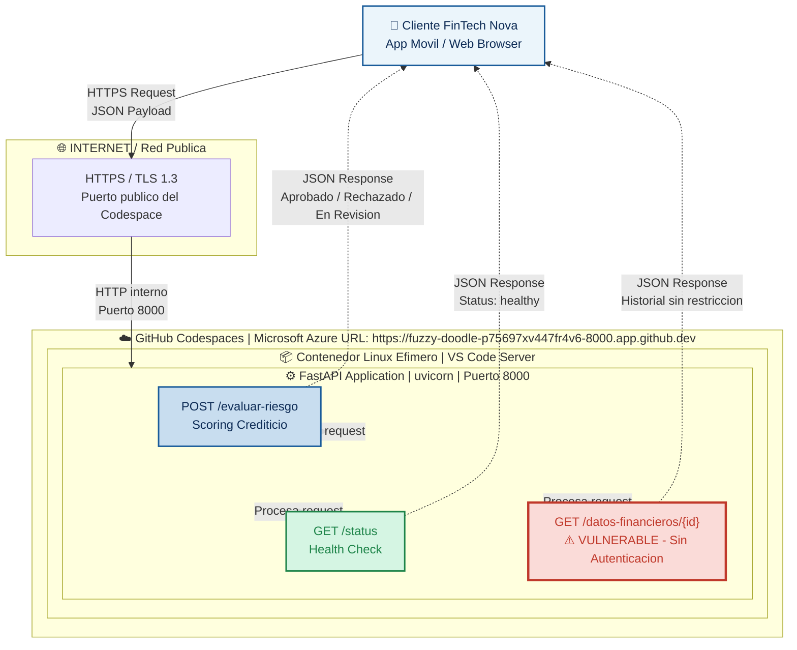

# Seminario — Arquitecturas Digitales Seguras y Automatizadas

## Proyecto Final Integrador: Arquitectura, Seguridad y Automatización de una API de Predicción en la Nube
### Roslaysoft x FinTech Nova

## Tabla de Contenido

- [Descripción del Proyecto](#descripción-del-proyecto)
- [Integrantes del Grupo](#integrantes-del-grupo)
- [Laboratorio 1 — Arquitectura As-Is](#laboratorio-1--arquitectura-as-is)
- [Laboratorio 2 — Auditoría y Hardening (SQL Injection)](#laboratorio-2--auditoría-y-hardening-sql-injection)
- [Laboratorio 3 — Automatización, Monitoreo y Contenerización](#laboratorio-3--automatización-monitoreo-y-contenerización)
- [Laboratorio 4 — CI/CD con GitHub Actions](#laboratorio-4--cicd-con-github-actions)
- [Tecnologías Utilizadas](#tecnologías-utilizadas)

---

## Descripción del Proyecto

En la actualidad, las aplicaciones no operan de forma aislada; viven en ecosistemas dinámicos en la nube que requieren ser rápidos, seguros y escalables. Durante este seminario, los estudiantes actuaron como Arquitectos Cloud para una empresa simulada de tecnología.

### El Caso de Estudio: "FinTech Nova" y la API de Riesgo Crediticio

La firma consultora Roslaysoft cerró un contrato con FinTech Nova, una startup financiera de rápido crecimiento que ofrece microcréditos 100% digitales. Inicialmente, FinTech Nova tenía su motor de "Evaluación de Riesgo Crediticio" (Credit Scoring) corriendo en un servidor local antiguo que se saturaba los fines de semana.

El equipo de Roslaysoft tomó el código base de ese motor (la API en FastAPI) y diseñó una arquitectura en la nube segura, escalable y automatizada, a través de cuatro laboratorios incrementales.

---

## Integrantes del Grupo

**Grupo 9**

| Integrante | GitHub |
| --- | --- |
| David Felipe Triana González | [@dftrianag-code](https://github.com/dftrianag-code) |
| Frank Leonardo Carvajal Rojas | [@flcarvajalr-collab](https://github.com/flcarvajalr-collab) |
| Juan Felipe Escobar Florez | — |

---

## Laboratorio 1 — Arquitectura As-Is

### URL del Codespace

URL pública de la API SeminarioSanMateo (bifurcado de RoslayBautista/SeminarioSanmateo):

https://laughing-yodel-p7jp54gxj9gr37qjr-8000.app.github.dev/

https://laughing-yodel-p7jp54gxj9gr37qjr-8000.app.github.dev/docs

URL pública de la API en el repositorio propio del grupo:

https://fuzzy-doodle-p75697xv447fr4v6-8000.app.github.dev/

### Diagrama Arquitectónico As-Is

El siguiente diagrama representa el estado inicial del sistema de evaluación de riesgo crediticio de FinTech Nova, desplegado en GitHub Codespaces, antes de aplicar controles de seguridad, contenerización o automatización:


### Versión interactiva (Mermaid)



---

## Laboratorio 2 — Auditoría y Hardening (SQL Injection)

### Descripción

Práctica académica enfocada en la identificación, explotación controlada y mitigación de vulnerabilidades de SQL Injection en la API, desarrollada con Python y FastAPI. El objetivo fue comprender el impacto de esta vulnerabilidad y aplicar mecanismos de protección para fortalecer la seguridad de la aplicación.

### Objetivos

- Comprender el funcionamiento de los ataques SQL Injection.
- Identificar vulnerabilidades en consultas SQL.
- Implementar medidas de hardening.
- Aplicar consultas parametrizadas para prevenir ataques.
- Validar la efectividad de los controles implementados.

### Vulnerabilidad identificada

La aplicación construía consultas SQL utilizando directamente los datos ingresados por el usuario, permitiendo potencialmente la ejecución de código SQL malicioso. Riesgos asociados: acceso no autorizado, alteración de información, divulgación de datos sensibles y compromiso de la integridad de la base de datos.

### Medidas de Hardening implementadas

- Uso de consultas parametrizadas.
- Validación de entradas del usuario.
- Manejo seguro de errores.
- Restricción de información sensible en las respuestas.
- Aplicación de buenas prácticas de desarrollo seguro.

### Resultados obtenidos

Antes de aplicar las medidas de seguridad fue posible alterar el comportamiento de las consultas SQL mediante entradas manipuladas. Después de implementar las medidas de hardening:

✅ Los intentos de SQL Injection fueron bloqueados.
✅ La aplicación mantuvo el comportamiento esperado.
✅ Se redujo significativamente la superficie de ataque.
✅ Se fortaleció la seguridad del sistema.

### Evidencias y archivos de la práctica

- Informe de auditoría completo: [`practica_sql/auditoria.md`](practica_sql/auditoria.md)
- Evidencias de las pruebas: [`practica_sql/evidencias/`](practica_sql/evidencias/)

La carpeta `practica_sql/` contiene el código fuente de la aplicación, la implementación de las medidas de hardening, la configuración del entorno de desarrollo y las evidencias de validación de las correcciones.

---

## Laboratorio 3 — Automatización, Monitoreo y Contenerización

FinTech Nova API integra mecanismos de respaldo automático, monitoreo de recursos, análisis de logs de seguridad y despliegue mediante Docker.

### Estructura del proyecto
fintech-nova-api/

│

├── main.py

├── test_main.py

├── database.db

├── backup_db.sh

├── resource_monitor.sh

├── log_analyzer.py

├── health_check.py

├── deploy.sh

├── Dockerfile

├── Dockerfile.dev

├── docker-compose.yml

├── requirements.txt

├── requirements-dev.txt

├── .dockerignore

├── backups/

└── data/

### Funcionalidades clave

| Componente | Función |
| --- | --- |
| `backup_db.sh` | Respaldo comprimido de la base de datos con limpieza automática (retención de 7 días) |
| Cron (`crontab`) | Ejecuta el backup automáticamente todas las noches a las 2:00 a.m. |
| `resource_monitor.sh` | Verifica uso de memoria RAM y espacio en disco, generando advertencias |
| `log_analyzer.py` | Detecta patrones de ataque en logs (OR 1=1, UNION SELECT, DROP TABLE, EXEC, comentarios SQL) |
| `ip_blacklist.txt` | Registro histórico de IPs maliciosas detectadas |
| `health_check.py` | Verifica base de datos, disco, backups y memoria; expone estados healthy / degraded / unhealthy en `/health` |
| `Dockerfile` | Imagen de producción, usuario no-root, HEALTHCHECK automático |
| `Dockerfile.dev` | Imagen de desarrollo con hot reload |
| `docker-compose.yml` | Orquesta la API junto con Redis (preparado para caché) |
| `deploy.sh` | Automatiza build, detención de versión anterior y verificación de salud del nuevo contenedor |

### Ejecución rápida

```bash
cd fintech-nova-api
docker build -t fintech-nova:1.0 .
docker run -d -p 8000:8000 --name fintech-api fintech-nova:1.0
curl http://localhost:8000/health
```

📄 **Documentación completa y detallada del Laboratorio 3** (instalación paso a paso, configuración de Cron, Docker Compose, solución de problemas, etc.): ver [`README_LAB3.md`](./README_LAB3.md)

---

## Laboratorio 4 — CI/CD con GitHub Actions

### Descripción

Se implementó un pipeline de Integración y Despliegue Continuo (CI/CD) en GitHub Actions, definido en [`.github/workflows/ci-cd-pipeline.yml`](.github/workflows/ci-cd-pipeline.yml), que se activa automáticamente en cada `push` a la rama `main`.

### Pasos del pipeline

1. **Checkout** — descarga el código del repositorio.
2. **Configurar Python 3.11** — entorno consistente entre desarrollo y CI.
3. **Instalar dependencias** — `requirements.txt` y `requirements-dev.txt`.
4. **Auditoría de seguridad (pip-audit)** — bloquea el pipeline si alguna dependencia tiene una vulnerabilidad conocida (enfoque Shift-Left / DevSecOps).
5. **Pruebas automáticas (pytest)** — valida la lógica de negocio del motor de riesgo crediticio.
6. **Construcción de la imagen Docker** — etiquetada con el SHA del commit (`fintech-nova:${{ github.sha }}`).
7. **Smoke test** — levanta la imagen y verifica que `/status` responde correctamente antes de considerarla lista.

### Ejecutar las pruebas localmente

```bash
cd fintech-nova-api
pip install -r requirements.txt -r requirements-dev.txt
pytest test_main.py -v
```

### Ver el estado del pipeline

El badge al inicio de este README refleja el estado del último run. El historial completo de ejecuciones está disponible en la pestaña [Actions](https://github.com/dftrianag-code/SeminarioSanmateo/actions) del repositorio.

---

## Tecnologías Utilizadas

- Python 3.11 / FastAPI / Uvicorn / Pydantic
- SQLite
- Docker / Docker Compose / Redis (preparado para caché)
- GitHub Actions (CI/CD)
- pip-audit (auditoría de seguridad de dependencias)
- pytest / httpx (pruebas automáticas)
- Cron (automatización de tareas)
- GitHub Codespaces

---

*Proyecto académico desarrollado para el Seminario de Arquitecturas Digitales Seguras y Automatizadas — Roslaysoft x FinTech Nova.*
